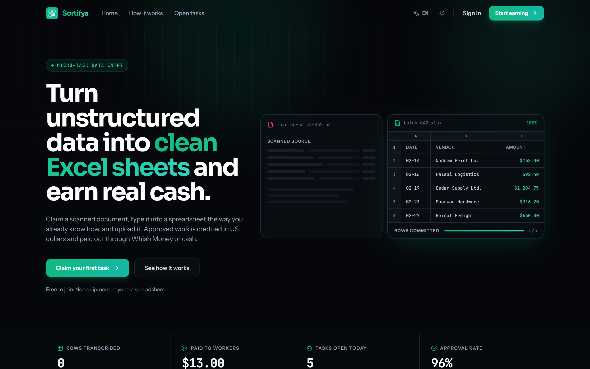

# Sortifya

A micro-task data entry platform. Workers claim a scanned PDF, transcribe it into a
spreadsheet offline, upload the result, and get paid in US dollars through Whish
Money or cash once an admin approves it.



```
Landing page → register → claim a PDF → type it into Excel → upload
            → admin review → ledger credit → withdraw at $10
```

<sub>Figures in the screenshot come from the seeded demo data — a fresh clone
shows its own.</sub>

---

## Requirements

| | |
|---|---|
| PHP | 8.2+ (built and verified on 8.5) |
| Database | MySQL / MariaDB via XAMPP, `127.0.0.1:3306` |
| Node | 20+ |
| Extensions | `pdo_mysql`, `zip`, `gd`, `mbstring`, `fileinfo` |

---

## Setup

Start Apache and MySQL in the XAMPP control panel, then create the database
(phpMyAdmin → New → `sortifya_db`, or from the shell):

```bash
mysql -u root -e "CREATE DATABASE sortifya_db CHARACTER SET utf8mb4 COLLATE utf8mb4_unicode_ci;"
```

Install and boot:

```bash
composer install && npm install && cp .env.example .env && php artisan key:generate && php artisan storage:link && php artisan migrate --seed && npm run build
```

Then run it:

```bash
composer dev
```

That starts the web server, the task scheduler, and Vite together on
<http://localhost:8000>.

### Serving it from XAMPP's Apache instead

Dropping the project in `htdocs` puts it in a **subdirectory**. Set `ASSET_URL`
to that base path — no scheme, no host:

```dotenv
ASSET_URL=/sortifya/public
```

Then `php artisan optimize:clear`.

`ASSET_URL` is not optional here. Without it Livewire emits a root-relative
`/livewire/livewire.js`, which 404s anywhere but the domain root — and because
Filament's admin UI is Alpine-driven, a missing Livewire renders `/admin` as a
**blank page** with the HTML fully present behind it.

Path-only is deliberate: it produces root-relative asset URLs, so one value
serves `http://localhost`, an `https` tunnel, and any domain you point at the
app later.

Cleaner still is a virtual host with `DocumentRoot` at `.../sortifya/public`,
which puts the app at a domain root and lets `ASSET_URL` stay empty.

### Exposing it through a tunnel (ngrok, Cloudflare, …)

Works with the path-only `ASSET_URL` above and nothing else to change. Set
`APP_URL` to the public address so password-reset mail links resolve:

```dotenv
APP_URL=https://your-subdomain.ngrok-free.dev/sortifya/public
```

The app trusts proxy headers (`bootstrap/app.php`), so it sees the request as
HTTPS even though the tunnel forwards plain HTTP to Apache. Without that, every
generated URL would come back `http://` on an `https://` page and browsers
would block it as mixed content.

### Seeded accounts

| Role | Email | Password |
|---|---|---|
| Admin | `admin@sortifya.com` | `password123` |
| Worker (balance above the $10 floor) | `rania@example.com` | `password123` |
| Worker (balance below the floor) | `karim@example.com` | `password123` |

The two workers are seeded into deliberately different states so both branches of
the wallet screen — the payout form and the "still saving up" progress bar — can be
seen without editing data by hand.

---

## Configuration

### Mail — Brevo SMTP

Password resets go out through Brevo. In `.env`, `MAIL_USERNAME` is the SMTP login
Brevo shows you (an address); `MAIL_PASSWORD` is the **SMTP key** from
*Brevo → SMTP & API*, not your account password.

```dotenv
MAIL_MAILER=smtp
MAIL_HOST=smtp-relay.brevo.com
MAIL_PORT=587
MAIL_ENCRYPTION=tls
MAIL_USERNAME=
MAIL_PASSWORD=
MAIL_FROM_ADDRESS="no-reply@sortifya.com"
```

Reset mail is sent in whichever language the request was made in — the locale is
captured at the moment the worker presses the button, not read from the queue
worker's environment.

### Telegram payout alerts

Optional. Every payout request is pushed to an admin chat with inline
**Approve** / **Reject** buttons; pressing one settles the request and rewrites the
message with the outcome.

```dotenv
TELEGRAM_BOT_TOKEN=
TELEGRAM_ADMIN_CHAT_ID=
TELEGRAM_WEBHOOK_SECRET=
```

Register the webhook once the app is reachable over HTTPS:

```bash
curl -X POST "https://api.telegram.org/bot<TOKEN>/setWebhook" -d "url=https://your-host/api/telegram/webhook" -d "secret_token=<TELEGRAM_WEBHOOK_SECRET>"
```

Telegram echoes that secret on every call, and the controller compares it with
`hash_equals`. **With no secret set the endpoint returns 403** — it fails closed
rather than running an open endpoint that moves money.

Telegram is a convenience channel, never a dependency: if the bot is unconfigured
or the API is down, the call is logged and the payout still waits in `/admin`.

### Platform rules

```dotenv
SORTIFYA_TASK_HOLD_MINUTES=45     # how long a claimed task locks to one worker
SORTIFYA_MAX_CONCURRENT_TASKS=1   # tasks a worker may hold at once
SORTIFYA_MIN_WITHDRAWAL=10.00     # payout floor, USD
SORTIFYA_PREVIEW_ROWS=10          # rows lifted into the admin preview
```

---

## How it works

### The ledger is the balance

There is no cached total on `users`. A balance is always `SUM(amount)` over that
worker's `transactions`, so a displayed figure can never drift from the rows behind
it. Credits are positive, debits negative, and **nothing updates or deletes an
existing line** — a mistake is corrected by writing an opposing one. That is why a
declined payout leaves two rows behind (`-10.00` then `+10.00`) instead of one row
disappearing: the pair *is* the audit trail.

`WalletService` is the only class allowed to write to the ledger.

### Claiming is the contended path

Several workers refresh the same queue and press **Claim** within the same second.
`TaskService::claim()` re-reads the row `FOR UPDATE` inside a transaction, so
exactly one of them wins and the rest get a clean "already taken" rather than a
double assignment.

A claim holds for 45 minutes. `tasks:release-expired` runs every five minutes
(wired in `bootstrap/app.php`) and returns lapsed holds to the queue.

```bash
php artisan schedule:work
```

In production, point cron at the scheduler once a minute:

```bash
* * * * * cd /path/to/sortifya && php artisan schedule:run >> /dev/null 2>&1
```

### Uploads are private

Submitted spreadsheets are written to `storage/app/private/submissions/`, outside
the web root. The only way to reach one is `GET /submissions/{id}/download`, which
checks that the asker either wrote it or reviews submissions.

At upload time the first rows are lifted into `parsed_preview_data` so a reviewer
can judge a submission in the admin table without touching the file. A read filter
caps what PhpSpreadsheet loads, so a 40,000-row upload costs eleven rows of memory
rather than forty thousand. A file that will not parse still reaches review — the
preview panel says so and offers the download instead.

---

## Admin panel

Filament v3 at `/admin`, gated on `role = admin` **and** `is_active` — suspending an
admin closes the panel to them too.

| Resource | What it does |
|---|---|
| **Tasks** | Upload source PDFs and column templates, set the USD reward, author both languages, return a stuck task to the queue |
| **Submissions** | Inline preview of the parsed rows, download, approve (credits the reward and retires the task), or return with a reason |
| **Payouts** | Mark paid, or decline with a refund |
| **Users** | Suspend or reopen an account, read the full ledger, credit a bonus |

Approving is guarded against a double-click: a submission that is already approved
returns untouched rather than paying twice.

---

## Localisation

English (LTR) and Arabic (RTL), switched from the navbar and persisted in a session
plus a year-long cookie, so the choice survives logging out. The `<html>` element
carries the matching `lang` and `dir`.

Arabic swaps the entire type stack to IBM Plex Sans Arabic — the Latin faces have no
usable Arabic cuts. Money and counters stay in JetBrains Mono with `direction: ltr`
in both languages, so a figure never reflows.

Copy lives in `lang/{en,ar}/sortifya.php`. Task titles and descriptions are stored
in two columns rather than a JSON blob, so both languages are required at authoring
time and neither can silently go missing.

---

## Design

Dark-first, emerald-to-teal, built around the product's own material: tabular data.
The hero is a live PDF→spreadsheet transformation — ragged scan lines on the left
that commit, row by row, into an aligned ledger on the right. Step markers are
spreadsheet row references (`R1/R2/R3`) because the content genuinely is a sequence.

- **Display** Sora · **Body** Instrument Sans · **Data** JetBrains Mono · **Arabic** IBM Plex Sans Arabic
- Every figure on the platform — balances, rewards, countdowns — is set in mono with
  tabular figures, so columns of money line up and never jitter as they tick.
- Amber is reserved strictly for "waiting on someone": a countdown under five
  minutes, a submission in review, a payout pending. It is never decoration.
- Confetti fires on a successful submission and on a payout request, and respects
  `prefers-reduced-motion` — as do AOS and every local animation.

---

## Tests

```bash
php artisan test
```

34 tests covering the parts where a bug costs money or lets someone in:

- the root URL renders for a guest and never redirects to `/login`
- a second worker cannot claim a held task; a worker holds one at a time
- the sweeper returns lapsed holds and leaves live ones alone
- approving credits exactly the reward, once, even if clicked twice
- payouts respect the floor and the balance; declining refunds without erasing the debit
- a settled payout cannot be decided again
- the Telegram webhook refuses a bad secret, is closed when unconfigured, and is replay-safe

Tests run against a separate `sortifya_db_test` schema on MySQL — not sqlite —
because the app leans on MySQL-specific behaviour (`JSON_EXTRACT` in the landing
stats, `SELECT … FOR UPDATE` in the claim path) that a different engine would not
exercise. Create it once:

```bash
mysql -u root -e "CREATE DATABASE sortifya_db_test CHARACTER SET utf8mb4 COLLATE utf8mb4_unicode_ci;"
```

---

## Notes

- **Spreadsheet parsing** uses `phpoffice/phpspreadsheet` directly rather than
  `maatwebsite/excel`. On PHP 8.5 the Excel wrapper cannot install: its v3 line
  requires PhpSpreadsheet 1.x, which caps at `php <8.5.0`, and the PHP-8.5-capable
  successor has no stable release. Parsing is isolated behind
  `App\Services\SpreadsheetParser`, so swapping back is a one-file change.
- Filament v3 on PHP 8.5 emits deprecation notices from its own internals (null
  array offsets). They are harmless and go away on Filament v4.
- Icons are generated from the `lucide-static` package into
  `app/Support/LucideIcons.php`, so the app ships real Lucide geometry with no
  runtime dependency on `node_modules`. Regenerate that file if you change the icon
  set; do not hand-edit it.
- The Blade icon component is `<x-lucide name="…" />`, not `<x-icon>` — Filament's
  `blade-icons` dependency already registers a global `<x-icon>`.
